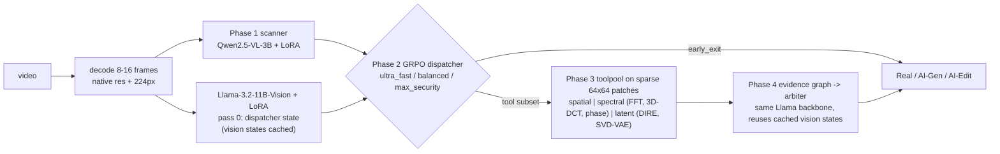

# Chrono-Spectral Forensics (CSF): training pipeline

Distributed PyTorch implementation of the **Chrono-Spectral Forensics** proposal (*Agentic Forensic Systems for
AI-Generated Video Detection*). It uses **Chrono-TriClass-100k** (`madhav-yrc/Chrono-TriClass-100k`, 97,774 videos)
to classify each video as **Real / AI-Generated / AI-Edited**. It then runs an ablation study across three model
types, reports detailed metrics (quality, calibration, robustness and latency), and pushes the weights and metrics to
a Hugging Face model repo.



## What gets trained and compared

| Id | Model type | What it is |
|---|---|---|
| A | `A_qwen_scanner` | Qwen2.5-VL-3B-Instruct + LoRA + linear head. Reads the frames as video (Phase 1 only). |
| B | `B_llama_arbiter_static` | Llama-3.2-11B-Vision-Instruct + LoRA. Reads a 2x2 frame mosaic plus the evidence graph from **all** tools (Phases 3 and 4, no routing). |
| C | `C_csf_agentic_<profile>` | Full CSF: scanner, then the GRPO dispatcher, then only the chosen tools, then the arbiter reusing the dispatcher's vision states. Trained once per proposal profile: `ultra_fast` (λ=1, β=0, no latent tool), `balanced` (λ=0.2, β=0.5), `max_security` (λ=0, β=2). |

The report also includes these supporting rows:
- **Fixed-routing ladder** (`csf_fixed_<action>`): each tool subset run without a learned dispatcher.
- **`baseline_toolpool_gbdt`**: forensic features only, no VLM.
- **`baseline_metadata_shortcut`**: gradient boosting on container metadata (resolution, fps, codec, bitrate). It shows how much of the dataset can be solved from source cues alone. Read the VLM numbers against it.

**Metrics** for each model are written to `runs/<run>/metrics/`:
- Quality: accuracy, balanced accuracy, macro and weighted F1, MCC, Cohen's κ.
- Per class: precision, recall, F1, ROC-AUC, PR-AUC, plus confusion matrices.
- Calibration: log-loss, Brier score, ECE.
- Forensic behaviour: binary fake-detection recall, miss rate, false-alarm rate, Edited↔Generated confusion, and accuracy per AI-Edited method.
- Latency: p50/p90/p95/p99, throughput, tool cost, routing distribution and early-exit rate.
- Live raw-video latency benchmark and training curves.
- Plots: Pareto frontier, confusion matrices, ROC curves, bar charts, loss and GRPO reward curves.

## Repository layout

```
main.py                   stage driver (resumable) - the only entry point
configs/test.yaml         test run: 5 000 videos, 12-16 GB GPU (e.g. laptop RTX 5070 Ti 12 GB)
configs/full.yaml         full run: all videos, >=24 GB GPU(s), tuned for speed + quality
configs/smoke_cpu.yaml    CPU wiring check with tiny random models (no GPU, no gated weights)
manifest.csv              Chrono-TriClass-100k manifest (leakage-aware train/valid/test split)
setup_env.ps1 / .sh       environment setup (Windows / Linux)
scripts/                  launch.ps1/.sh (auto torchrun on >1 GPU), run_test.*, run_full.*
csf/
  data/manifest.py        manifest -> repo paths, stratified run subset
  data/video_io.py        HF download with backoff, OpenCV decoding, mosaics, JPEG frame storage
  data/feature_cache.py   distributed, resumable, disk-bounded extraction (frames + toolpool features)
  data/extract_worker.py  torch-free CPU worker (download, decode, spatial / spectral tools)
  data/datasets.py        cached dataset + Qwen / Llama collators
  tools/toolpool.py       Phase 3 spatial / spectral / latent (DIRE) tools
  graph.py                Phase 4 evidence graph + arbiter prompt serialisation
  models/classifier.py    quantised VLM + LoRA + pooled classification head
  models/dispatcher.py    Phase 2 policy, reward, profiles, GRPO trainer
  train/classifier_trainer.py  DDP training loop
  pipeline.py             scanner inference + shared-backbone outcome tables
  eval/                   metrics, ablation + report, live latency benchmark
  hub.py                  export bundle, model card, interactive Hub push
  inference.py            CSFDetector: raw video -> verdict (used by the published repo)
  env_check.py            environment verification
  launch.py               multi-GPU process launcher (used on Windows instead of torchrun)
```

## 0. Regenerating the AI-Edited class

The AI-Edited third of the dataset can be rebuilt from scratch from Kinetics-400, following
*AI Edited Data Source and Pipeline*: **33,333 videos, 8 manipulation families, 32 models**, each
video traceable to its source clip, its model and its edit parameters (the old class had 89% of
its `generator_edit_method` values as `"unknown"`).

```bash
python -m csf.generation.spec          # the full allocation plan, self-checked
python -m csf.generation.adapters      # per-model status: which are wired, which are not
bash scripts/run_regen.sh --envs       # build the per-model environments
bash scripts/run_regen.sh --kinetics   # acquire + qualify the source clips
bash scripts/run_regen.sh --generate   # render on GPUs 2/3/4
bash scripts/run_regen.sh --manifest   # rebuild manifest.csv around what was produced
bash scripts/run_regen.sh --train      # train on the new dataset
```

13 of the 32 models are wired end to end today (11,688 videos, 35%); the rest are registered but
refuse their jobs rather than emitting placeholder video. Full runbook, coverage table, timings
and troubleshooting: **[docs/REGENERATION.md](docs/REGENERATION.md)**.

## 1. Setup

**Windows (PowerShell):**
```powershell
powershell -ExecutionPolicy Bypass -File setup_env.ps1            # CUDA 12.8 wheels (RTX 50xx needs cu128+)
.venv\Scripts\Activate.ps1
huggingface-cli login                                               # READ token
```

**Linux:**
```bash
bash setup_env.sh --cuda cu128            # add --flash-attn to try installing flash-attention 2
source .venv/bin/activate
huggingface-cli login
```

The setup scripts pick Python 3.12 or 3.11 when available, install the CUDA build of PyTorch and then
`requirements.txt`, and finish with `python -m csf.env_check`. That check verifies the GPU, bf16 support,
a real CUDA matmul, a bitsandbytes 4-bit forward pass, OpenCV's ffmpeg backend, the distributed backend and your
Hub login.

**Gated model:** `meta-llama/Llama-3.2-11B-Vision-Instruct` requires accepting its licence on its Hub page first.
The pipeline checks access before any heavy work and fails in seconds if the token can't reach it. In an interactive
single-GPU run it offers to take a token for the current session.

Logging in also raises the Hub rate limits for the dataset download. Rate-limit (429) and connection errors are
retried with exponential backoff.

## 2. Test run (checks the pipeline end to end)

```powershell
powershell -ExecutionPolicy Bypass -File scripts\run_test.ps1        # Windows
```
```bash
bash scripts/run_test.sh                                             # Linux
```

This takes a stratified 5,000-row subset of the manifest (about 4.0k train, 0.5k valid, 0.5k test; every split has
all three classes) and runs **every stage**, finishing with the Hub push prompt.

It is tuned for a single 12 GB card:
- 4-bit NF4 QLoRA for both VLMs, including the Llama vision tower.
- 8 frames per video.
- Batch 1–2 with gradient accumulation, non-reentrant gradient checkpointing and paged 8-bit AdamW.
- `logits_to_keep=1`, so the 128k-vocab LM head runs on one token only.
- Models load one stage at a time and are freed between stages.
- The live latency benchmark loads Qwen, then Llama with the VAE, rather than both at once.
- Optimiser steps are capped (150 for Qwen, 100 for Llama).

Test-run metrics show the pipeline works. They are not the final model quality.

CPU-only wiring check (tiny random models, a few minutes after the videos download):
```bash
python main.py --config configs/smoke_cpu.yaml
```

## 3. Full training run

```bash
bash scripts/run_full.sh                                   # all GPUs on the node, torchrun + NCCL
```
```powershell
powershell -ExecutionPolicy Bypass -File scripts\run_full.ps1   # Windows
```
On Windows with more than one GPU, the launcher uses `python -m csf.launch --nproc N`, which spawns one process per
GPU with a Gloo backend and a file-based rendezvous. torchrun's TCP rendezvous fails on Windows builds of PyTorch
(libuv store errors). On Linux the launcher uses `torchrun` with NCCL.

The full profile is tuned for speed and quality on 24 GB or more:
- All 97,774 videos with 16 frames each and 8 forensic patches.
- The Qwen scanner trains in **bf16** (no quantisation) with fused AdamW.
- The Llama text decoder uses 4-bit NF4, while its **vision tower stays in bf16**.
- Larger per-GPU batches, 8 dataloader workers, TF32 matmuls and resident models for the latency benchmark.

Useful overrides:
```bash
# >= 48 GB GPUs: Llama in bf16 as well
bash scripts/run_full.sh --set train.llama.quantization=none --set train.llama.batch_size=4
# Linux + flash-attn installed
bash scripts/run_full.sh --set models.attn_implementation=flash_attention_2
```

## 4. Stages, resuming and overrides

`main.py` runs these stages in order, and each one records completion in `runs/<run>/state.json`:

```
prepare -> features -> train_qwen -> train_llama -> predict_scanner -> outcomes -> train_dispatcher
        -> evaluate -> export -> latency -> push
```

- **Re-running the same command resumes.** Completed stages are skipped, and feature extraction skips videos
  already cached. Training resumes from `checkpoints/<model>/last` with its optimiser and scheduler state.
- Run specific stages with `--stage train_llama,outcomes`. Redo a finished stage with `--force train_llama`.
- Override any config value with `--set section.key=value`, for example `--set data.max_rows=2000`.

## 5. Logs and debugging

Every failure can be traced to the stage, step and batch where it happened:

| File | Content |
|---|---|
| `runs/<run>/logs/rank<R>.log` | full DEBUG log per rank (timestamp, rank, stage, module:line) |
| `runs/<run>/logs/crash_rank<R>.json` | on failure: stage, last step / epoch / **video ids of the failing batch**, traceback, CUDA memory, platform |
| `runs/<run>/logs/fault_rank<R>.log` | Python stacks of all threads on native crashes (segfaults in CUDA / bitsandbytes / OpenCV) |
| `runs/<run>/logs/train_<model>.jsonl` | one line per optimiser step: loss, grad-norm, lr, peak memory |
| `cache/<run>/failed_rank<R>.csv` | every video that could not be downloaded / decoded, with the stage and error |
| `runs/torchrun_logs/` (Linux, multi-GPU) | raw per-rank stdout / stderr captured by torchrun |

The console shows tqdm bars along with rate and ETA lines for extraction, training, validation, outcome tables
and GRPO. Non-finite losses stop training and name the batch that caused them. Consecutive download or decode
failures abort with a clear message instead of silently producing an empty dataset.

### Troubleshooting

| Symptom | Fix |
|---|---|
| `CUDA out of memory` in `train_llama` inside `MllamaVisionEncoderLayer` | Mllama pads every image to `max_num_tiles=4` (6,404 patch tokens), and its global attention layers need a ~1.2 GiB attention matrix on GPUs without efficient SDPA kernels (Turing/T4). In order: (a) `--set train.llama.skip_quant_modules="[]"` (frees ~0.74 GiB; lm_head is unused because we pool hidden states with `logits_to_keep=1`), (b) `PYTORCH_CUDA_ALLOC_CONF=max_split_size_mb:128`, (c) swap the arbiter for the run: `--set models.llama_id=Qwen/Qwen2.5-VL-3B-Instruct` (works as-is; vision-state sharing auto-disables and is logged). |
| `CUDA out of memory` elsewhere on a 12 GB card | Close other GPU apps. Then `--set data.num_frames=6 --set train.llama.lora_r=8` and re-run the same command; it resumes. |
| `Qwen2VLVideoProcessor requires the Torchvision library` | torchvision is missing (the setup scripts install it with torch; a hand-built venv may not have it). Install the build matching your torch: `pip install torchvision --index-url https://download.pytorch.org/whl/cu130` (swap `cu130` for your `torch.version.cuda`). |
| `no kernel image is available` / `sm_120 not supported` | RTX 50xx needs CUDA 12.8+ wheels: `setup_env.ps1 -Cuda cu128` |
| `GatedRepoError` for Llama | Accept the licence on the model page, then `huggingface-cli login` |
| Many `download failed` / 429 lines | Log in to the Hub (higher limits) or lower `data.download_workers`. Re-running resumes. |
| Anything else | Open `runs/<run>/logs/crash_rank0.json`. It names the stage, step and video ids that failed. |

## 6. Outputs and publishing

- `runs/<run>/metrics/ablation_report.md`: the ablation tables and plots.
- `runs/<run>/metrics/ablation_metrics.json` and `ablation_summary.csv`: every metric for every model.
- `runs/<run>/metrics/latency_benchmark.json`: raw-video end-to-end latency through `CSFDetector`.
- `runs/<run>/export/`: the publishable bundle:
  - `README.md`: model card with results and usage guidelines.
  - `qwen_scanner/`, `llama_arbiter/`: LoRA adapters plus classification heads.
  - `dispatchers/*.pt`, `feature_stats.json`, `tool_costs.json`, `csf_config.json`.
  - `metrics/` and `code/`.

After the last stage, rank 0 asks for the **target repo id** and a **Hugging Face WRITE token** (hidden input). It
validates the token, creates the repo (private by default) and uploads the bundle. To push later, or from a
non-interactive session:
```bash
python main.py --config configs/full.yaml --stage push
```
Base-model weights are not re-uploaded. The adapters load on top of the original Qwen and Llama repos, which keeps
the Llama licence gating intact.

## 7. Using the trained model

```python
from csf.inference import CSFDetector
det = CSFDetector("runs/full/export")          # or "<namespace>/<repo>" after pushing
det.predict("clip.mp4", mode="agentic", profile="balanced")
# {'label': 'AI-Edited', 'probs': {...}, 'action': 'spatial_spectral', 'tools_run': [...],
#  'latency_ms': {'decode': ..., 'scanner': ..., 'dispatcher_state': ..., 'tools': ..., 'arbiter': ...},
#  'evidence_graph': {...}}
```
Or from the command line: `python -m csf.inference clip.mp4 --model_dir runs/full/export --mode agentic`.

## Design notes

- **Forensic signal preservation.** Tools run on native-resolution frames (capped at `tool_max_side`) and on
  sparse 64x64 patches chosen by texture entropy and motion. The VLMs see 224px frames, stored as JPEG q95 in the
  cache, which keeps the cache at about 25 GB instead of about 235 GB for the full dataset.
- **Classification head, not text generation.** Each VLM's final-norm hidden state at the last token feeds a
  linear head. This gives calibrated probabilities in one forward pass, and LoRA touches only the language models.
- **Shared dispatcher/arbiter state.** The Llama vision encoder runs once per video. Every routed arbiter pass
  reuses the cached cross-attention states. The pipeline logs a sanity check that the cached and full passes agree.
- **Honest cost model.** Tool costs in the GRPO reward are the *measured* median seconds of each tool group plus
  the arbiter pass, normalised to [0, 1] so a correct answer is never outweighed by its cost.
- **No leakage into routing.** Dispatchers are trained on the validation outcome table, which neither VLM was fit
  on. The test split is used only for the final report.
- **Limitations.** The dataset has no manipulation masks, so the proposal's `α·R_attr` (mIoU) term is 0. The
  evidence graph encodes hypothesised mechanisms, not established causal relations.
