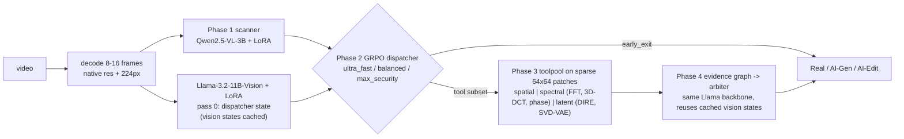

# Chrono-Spectral Forensics (CSF): training pipeline

Distributed PyTorch implementation of the **Chrono-Spectral Forensics** proposal (*Agentic Forensic Systems for
AI-Generated Video Detection*). It uses **Chrono-TriClass-100k** (`madhav-yrc/Chrono-TriClass-100k`, 97,774 videos)
to classify each video as **Real / AI-Generated / AI-Edited**. It then runs an ablation study across three model
types, reports detailed metrics (quality, calibration, robustness and latency), and pushes the weights and metrics to
a Hugging Face model repo.



## What gets trained and compared

| Id | Model type | What it is |
|---|---|---|
| A | `A_qwen_scanner` | Qwen2.5-VL-3B-Instruct + LoRA + linear head. Reads the frames as video (Phase 1 only). |
| B | `B_llama_arbiter_static` | Llama-3.2-11B-Vision-Instruct + LoRA. Reads a 2x2 frame mosaic plus the evidence graph from **all** tools (Phases 3 and 4, no routing). |
| C | `C_csf_agentic_<profile>` | Full CSF: scanner, then the GRPO dispatcher, then only the chosen tools, then the arbiter reusing the dispatcher's vision states. Trained once per proposal profile: `ultra_fast` (λ=1, β=0, no latent tool), `balanced` (λ=0.2, β=0.5), `max_security` (λ=0, β=2). |

The report also includes these supporting rows:
- **Fixed-routing ladder** (`csf_fixed_<action>`): each tool subset run without a learned dispatcher.
- **`baseline_toolpool_gbdt`**: forensic features only, no VLM.
- **`baseline_metadata_shortcut`**: gradient boosting on container metadata (resolution, fps, codec, bitrate). It shows how much of the dataset can be solved from source cues alone. Read the VLM numbers against it.

**Metrics** for each model are written to `runs/<run>/metrics/`:
- Quality: accuracy, balanced accuracy, macro and weighted F1, MCC, Cohen's κ.
- Per class: precision, recall, F1, ROC-AUC, PR-AUC, plus confusion matrices.
- Calibration: log-loss, Brier score, ECE.
- Forensic behaviour: binary fake-detection recall, miss rate, false-alarm rate, Edited↔Generated confusion, and accuracy per AI-Edited method.
- Latency: p50/p90/p95/p99, throughput, tool cost, routing distribution and early-exit rate.
- Live raw-video latency benchmark and training curves.
- Plots: Pareto frontier, confusion matrices, ROC curves, bar charts, loss and GRPO reward curves.

## Repository layout

```
main.py                   stage driver (resumable) - the only entry point
configs/test.yaml         test run: 5 000 videos, 12-16 GB GPU (e.g. laptop RTX 5070 Ti 12 GB)
configs/full.yaml         full run: all videos, >=24 GB GPU(s), tuned for speed + quality
configs/smoke_cpu.yaml    CPU wiring check with tiny random models (no GPU, no gated weights)
configs/regen.yaml        AI-Edited regeneration + training (4x H200)
configs/regen_smoke.yaml  200-video generator wiring check
tests/test_generation.py  dependency-free checks for the generator's allocation
manifest.csv              Chrono-TriClass-100k manifest (leakage-aware train/valid/test split)
setup_env.ps1 / .sh       environment setup (Windows / Linux)
scripts/                  launch.ps1/.sh (auto torchrun on >1 GPU), run_test.*, run_full.*
csf/
  generation/             AI-Edited dataset generator (see docs/REGENERATION.md)
    spec.py               the specification as data + exact integer allocation
    prefetch.py           Hugging Face model/dataset prefetch, gated-repo checks
    kinetics.py           Kinetics-400 acquisition (HF mirror, layout-detecting)
    filters.py            per-clip qualification (face / mouth / object)
    jobs.py               plan -> 33,333 deterministic jobs, leakage-aware splits
    budget.py             fit the run into a wall-clock budget
    envs.py               one virtual environment per model, built on demand
    adapters/             model registry + persistent-worker protocol + workers
    scheduler.py          multi-GPU execution, batched by model, resumable
    manifest_build.py     generated videos -> a new dataset manifest
    upload.py             publish the new class back to the Hub
  data/manifest.py        manifest -> repo paths, stratified run subset
  data/video_io.py        HF download with backoff, OpenCV decoding, mosaics, JPEG frame storage
  data/feature_cache.py   distributed, resumable, disk-bounded extraction (frames + toolpool features)
  data/extract_worker.py  torch-free CPU worker (download, decode, spatial / spectral tools)
  data/datasets.py        cached dataset + Qwen / Llama collators
  tools/toolpool.py       Phase 3 spatial / spectral / latent (DIRE) tools
  graph.py                Phase 4 evidence graph + arbiter prompt serialisation
  models/classifier.py    quantised VLM + LoRA + pooled classification head
  models/dispatcher.py    Phase 2 policy, reward, profiles, GRPO trainer
  train/classifier_trainer.py  DDP training loop
  pipeline.py             scanner inference + shared-backbone outcome tables
  eval/                   metrics, ablation + report, live latency benchmark
  hub.py                  export bundle, model card, interactive Hub push
  inference.py            CSFDetector: raw video -> verdict (used by the published repo)
  env_check.py            environment verification
  launch.py               multi-GPU process launcher (used on Windows instead of torchrun)
```

## 0. What this repo does, and the two halves you can run

There are two independent halves. You can run either on its own, or both end to end.

| Half | What it does | Entry point |
|---|---|---|
| **Dataset generator** | Builds the AI-Edited class from scratch: fetches Kinetics-400 clips, renders 33,333 manipulated videos with 24 models, rebuilds `manifest.csv` | `scripts/run_regen.sh` |
| **Training pipeline** | Trains the CSF scanner/arbiter/dispatcher on a manifest, runs the ablation, exports and publishes | `scripts/run_full.sh` |

The generator writes its videos where the training half looks for them, so "both" is just running
one after the other. Section 3 has the exact commands for each.

---

## 1. Setup

You need **Python 3.11 or 3.12**, **git**, **ffmpeg**, and an NVIDIA GPU with recent drivers.
Everything else the setup script installs.

### Linux

```bash
git clone https://github.com/Madhavyamjala/spectral-forensics-training-pipeline.git
cd spectral-forensics-training-pipeline

# 1. system packages (Ubuntu/Debian; use dnf/yum equivalents elsewhere)
sudo apt update && sudo apt install -y python3.12 python3.12-venv git ffmpeg

# 2. Python environment + CUDA build of PyTorch
bash setup_env.sh --cuda cu128          # use cu121 for older drivers
source .venv/bin/activate

# 3. log in to Hugging Face (needed for the gated Llama model and higher rate limits)
huggingface-cli login                   # paste a READ token

# 4. verify the machine
python -m csf.env_check
```

### Windows (PowerShell)

```powershell
git clone https://github.com/Madhavyamjala/spectral-forensics-training-pipeline.git
cd spectral-forensics-training-pipeline

# 1. ffmpeg (skip if you already have it on PATH)
winget install Gyan.FFmpeg

# 2. Python environment + CUDA build of PyTorch
powershell -ExecutionPolicy Bypass -File setup_env.ps1 -Cuda cu128
.\.venv\Scripts\Activate.ps1

# 3. log in to Hugging Face
huggingface-cli login

# 4. verify the machine
python -m csf.env_check
```

> **Windows note.** The *training* half runs on Windows. The *dataset generator* does not: its
> per-model environments clone Linux-only upstream repositories. Generate on Linux, then train
> anywhere.

`python -m csf.env_check` checks the GPU, bf16 support, a real CUDA matmul, a bitsandbytes 4-bit
forward pass, OpenCV's ffmpeg backend and your Hub login. Fix anything it reports before going on.

### Accept the gated licence

`meta-llama/Llama-3.2-11B-Vision-Instruct` is gated. Open its
[model page](https://huggingface.co/meta-llama/Llama-3.2-11B-Vision-Instruct), accept the licence,
then make sure your token can reach it:

```bash
python -m csf.generation.prefetch --stage train --dry-run
```

That checks every repository the run needs without downloading anything, and names any that are
gated, missing or private.

---

## 2. Download the models first

A full run touches ~21 Hub repositories. Pull them once, up front, so a gated licence or a typo
does not surface three days into generation:

```bash
python -m csf.generation.prefetch --list                 # what will be fetched, and why
python -m csf.generation.prefetch --stage train          # ~25 GB: Qwen, Llama, the VAEs
python -m csf.generation.prefetch --stage generate       # ~90 GB: SAM2, FLUX, VACE, LatentSync, ...
python -m csf.generation.prefetch --stage all            # everything
```

It resumes (the Hub cache is reused), retries rate limits with backoff, and reports the size of
each repository as it lands. `--stage generate` is only needed if you are running the generator.

---

## 3. The three ways to run this

### 3a. Dataset generator only

Builds the AI-Edited class and writes a new `manifest.csv`. Nothing is trained.

```bash
# smoke test first: 200 videos, 2 cheap models, ~30 minutes
python main.py --config configs/regen_smoke.yaml --stage kinetics,generate,regen_manifest

# then the real thing, phase by phase (each is resumable)
bash scripts/run_regen.sh --envs        # build the 18 per-model environments (2-4 h, once)
bash scripts/run_regen.sh --kinetics    # fetch + qualify Kinetics-400 source clips
bash scripts/run_regen.sh --generate    # render 33,333 videos  (~3.9 days on 4 GPUs)
bash scripts/run_regen.sh --manifest    # rebuild manifest.csv around what was produced
```

Inspect before committing days to it:

```bash
bash scripts/run_regen.sh --plan        # the 33,333-video allocation
bash scripts/run_regen.sh --adapters    # per-model: slot, renderer, videos, GPU-hours
bash scripts/run_regen.sh --eta         # time to produce the full set
bash scripts/run_regen.sh --status      # which environments are built
```

### 3b. Training only

Trains on a manifest that already exists — the stock `manifest.csv`, or one the generator wrote.

```bash
# smoke test: CPU-only wiring check with tiny random models, no GPU needed
python main.py --config configs/smoke_cpu.yaml

# small GPU test: 5,000 videos through every stage, fits a 12 GB card
bash scripts/run_test.sh                          # Linux
powershell -File scripts\run_test.ps1             # Windows

# full training run
bash scripts/run_full.sh                          # Linux, all GPUs
powershell -File scripts\run_full.ps1             # Windows
```

To train on a regenerated dataset, point it at the new manifest:

```bash
bash scripts/run_full.sh --set data.manifest=manifest_regen.csv
```

### 3c. Both, end to end

```bash
# smoke test the whole chain first (~1 h): tiny generation, then a CPU training pass
python main.py --config configs/regen_smoke.yaml --stage kinetics,generate,regen_manifest
python main.py --config configs/smoke_cpu.yaml --set data.manifest=manifest_regen_smoke.csv

# the real run
bash scripts/run_regen.sh --all
```

`--all` runs `kinetics → generate → regen_manifest → train` in order. Generation is
single-process (it schedules its own per-GPU workers); training then launches under `torchrun`.
Everything is resumable, so re-running the same command picks up where it stopped.

**Expected wall clock** on 4 × H200: prefetch 1–2 h, environments 2–4 h, Kinetics 8–20 h,
generation ~3.9 days, feature extraction 8–14 h, training + eval 1.5–2.5 days.

### Smoke tests at a glance

| Command | Needs | Time | Checks |
|---|---|---|---|
| `python -m csf.env_check` | — | seconds | GPU, bf16, CUDA matmul, ffmpeg, Hub login |
| `python -m csf.generation.prefetch --dry-run` | — | ~1 min | every Hub repo is reachable |
| `python tests/test_generation.py` | — | ~1 min | allocation, splits, budget, substitutions |
| `python main.py --config configs/smoke_cpu.yaml` | CPU | ~10 min | the whole training pipeline wires up |
| `python main.py --config configs/regen_smoke.yaml --stage kinetics,generate,regen_manifest` | 1 GPU | ~30 min | generation workers, ledger, manifest rebuild |
| `bash scripts/run_test.sh` | 1 GPU ≥12 GB | ~4 h | every training stage on 5,000 videos |

---

## 4. Regenerating the AI-Edited class

The AI-Edited third of the dataset is rebuilt from Kinetics-400 following
*AI Edited Data Source and Pipeline*: **33,333 videos, 8 manipulation families, 24 distinct
renderers**, each video traceable to its source clip, its model and its edit parameters (the old
class had 89% of its `generator_edit_method` values as `"unknown"`).

Six of the document's models have no runnable public release, so each family's target is
re-apportioned across the models that do run — family totals and source-group mixes stay exactly
as specified. Where a substitute stands in (VideoReTalking → LatentSync 1.6, SimSwap → DreamID-V,
AnyV2V/VideoComposer/InsV2V → VACE), the manifest records the model that *actually rendered* each
video in `model` and keeps the document's slot in `spec_model`.

Source clips come from the Hugging Face mirror
[`liuhuanjim013/kinetics400`](https://huggingface.co/datasets/liuhuanjim013/kinetics400); the
loader detects the repository's layout at runtime (one file per clip, tar/zip shards, or parquet)
and falls back to the CVDF S3 shards for anything the mirror cannot satisfy.

Full runbook, substitution table with metrics, licence warnings and troubleshooting:
**[docs/REGENERATION.md](docs/REGENERATION.md)**.

## 5. Training profiles and tuning

`configs/test.yaml` is tuned for a single 12 GB card: 4-bit NF4 QLoRA for both VLMs, 8 frames per
video, batch 1-2 with gradient accumulation, paged 8-bit AdamW, and models loaded one stage at a
time. Its metrics show the pipeline works; they are not final model quality.

`configs/full.yaml` is tuned for 24 GB or more: all videos at 16 frames with 8 forensic patches,
the Qwen scanner in bf16 with fused AdamW, the Llama text decoder in 4-bit NF4 with its vision
tower in bf16, larger per-GPU batches and TF32 matmuls.

`configs/regen.yaml` assumes 143 GB cards and puts both models in bf16 with much larger batches.

Useful overrides:
```bash
# >= 48 GB GPUs: Llama in bf16 as well
bash scripts/run_full.sh --set train.llama.quantization=none --set train.llama.batch_size=4
# Linux + flash-attn installed
bash scripts/run_full.sh --set models.attn_implementation=flash_attention_2
# fewer frames if you hit OOM on a small card
bash scripts/run_test.sh --set data.num_frames=6 --set train.llama.lora_r=8
```

On Windows with more than one GPU the launcher uses `python -m csf.launch --nproc N`, which spawns
one process per GPU with a Gloo backend and a file-based rendezvous; torchrun's TCP rendezvous
fails on Windows builds of PyTorch (libuv store errors). On Linux it uses `torchrun` with NCCL.

## 6. Stages, resuming and overrides

`main.py` runs these stages in order, and each one records completion in `runs/<run>/state.json`:

```
# dataset generator (only when generation.enabled)
prefetch -> kinetics -> generate -> regen_manifest -> push_dataset

# training pipeline
prepare -> features -> train_qwen -> train_llama -> predict_scanner -> outcomes
        -> train_dispatcher -> evaluate -> export -> latency -> push
```

- **Re-running the same command resumes.** Completed stages are skipped, and feature extraction skips videos
  already cached. Training resumes from `checkpoints/<model>/last` with its optimiser and scheduler state.
- Run specific stages with `--stage train_llama,outcomes`. Redo a finished stage with `--force train_llama`.
- Override any config value with `--set section.key=value`, for example `--set data.max_rows=2000`.

## 7. Logs and debugging

Every failure can be traced to the stage, step and batch where it happened:

| File | Content |
|---|---|
| `runs/<run>/logs/rank<R>.log` | full DEBUG log per rank (timestamp, rank, stage, module:line) |
| `runs/<run>/logs/crash_rank<R>.json` | on failure: stage, last step / epoch / **video ids of the failing batch**, traceback, CUDA memory, platform |
| `runs/<run>/logs/fault_rank<R>.log` | Python stacks of all threads on native crashes (segfaults in CUDA / bitsandbytes / OpenCV) |
| `runs/<run>/logs/train_<model>.jsonl` | one line per optimiser step: loss, grad-norm, lr, peak memory |
| `cache/<run>/failed_rank<R>.csv` | every video that could not be downloaded / decoded, with the stage and error |
| `runs/torchrun_logs/` (Linux, multi-GPU) | raw per-rank stdout / stderr captured by torchrun |

The console shows tqdm bars along with rate and ETA lines for extraction, training, validation, outcome tables
and GRPO. Non-finite losses stop training and name the batch that caused them. Consecutive download or decode
failures abort with a clear message instead of silently producing an empty dataset.

### Troubleshooting

| Symptom | Fix |
|---|---|
| `CUDA out of memory` in `train_llama` inside `MllamaVisionEncoderLayer` | Mllama pads every image to `max_num_tiles=4` (6,404 patch tokens), and its global attention layers need a ~1.2 GiB attention matrix on GPUs without efficient SDPA kernels (Turing/T4). In order: (a) `--set train.llama.skip_quant_modules="[]"` (frees ~0.74 GiB; lm_head is unused because we pool hidden states with `logits_to_keep=1`), (b) `PYTORCH_CUDA_ALLOC_CONF=max_split_size_mb:128`, (c) swap the arbiter for the run: `--set models.llama_id=Qwen/Qwen2.5-VL-3B-Instruct` (works as-is; vision-state sharing auto-disables and is logged). |
| `CUDA out of memory` elsewhere on a 12 GB card | Close other GPU apps. Then `--set data.num_frames=6 --set train.llama.lora_r=8` and re-run the same command; it resumes. |
| `Qwen2VLVideoProcessor requires the Torchvision library` | torchvision is missing (the setup scripts install it with torch; a hand-built venv may not have it). Install the build matching your torch: `pip install torchvision --index-url https://download.pytorch.org/whl/cu130` (swap `cu130` for your `torch.version.cuda`). |
| `no kernel image is available` / `sm_120 not supported` | RTX 50xx needs CUDA 12.8+ wheels: `setup_env.ps1 -Cuda cu128` |
| `GatedRepoError` for Llama | Accept the licence on the model page, then `huggingface-cli login` |
| Many `download failed` / 429 lines | Log in to the Hub (higher limits) or lower `data.download_workers`. Re-running resumes. |
| Anything else | Open `runs/<run>/logs/crash_rank0.json`. It names the stage, step and video ids that failed. |

## 8. Outputs and publishing

- `runs/<run>/metrics/ablation_report.md`: the ablation tables and plots.
- `runs/<run>/metrics/ablation_metrics.json` and `ablation_summary.csv`: every metric for every model.
- `runs/<run>/metrics/latency_benchmark.json`: raw-video end-to-end latency through `CSFDetector`.
- `runs/<run>/export/`: the publishable bundle:
  - `README.md`: model card with results and usage guidelines.
  - `qwen_scanner/`, `llama_arbiter/`: LoRA adapters plus classification heads.
  - `dispatchers/*.pt`, `feature_stats.json`, `tool_costs.json`, `csf_config.json`.
  - `metrics/` and `code/`.

After the last stage, rank 0 asks for the **target repo id** and a **Hugging Face WRITE token** (hidden input). It
validates the token, creates the repo (private by default) and uploads the bundle. To push later, or from a
non-interactive session:
```bash
python main.py --config configs/full.yaml --stage push
```
Base-model weights are not re-uploaded. The adapters load on top of the original Qwen and Llama repos, which keeps
the Llama licence gating intact.

## 9. Using the trained model

```python
from csf.inference import CSFDetector
det = CSFDetector("runs/full/export")          # or "<namespace>/<repo>" after pushing
det.predict("clip.mp4", mode="agentic", profile="balanced")
# {'label': 'AI-Edited', 'probs': {...}, 'action': 'spatial_spectral', 'tools_run': [...],
#  'latency_ms': {'decode': ..., 'scanner': ..., 'dispatcher_state': ..., 'tools': ..., 'arbiter': ...},
#  'evidence_graph': {...}}
```
Or from the command line: `python -m csf.inference clip.mp4 --model_dir runs/full/export --mode agentic`.

## Design notes

- **Forensic signal preservation.** Tools run on native-resolution frames (capped at `tool_max_side`) and on
  sparse 64x64 patches chosen by texture entropy and motion. The VLMs see 224px frames, stored as JPEG q95 in the
  cache, which keeps the cache at about 25 GB instead of about 235 GB for the full dataset.
- **Classification head, not text generation.** Each VLM's final-norm hidden state at the last token feeds a
  linear head. This gives calibrated probabilities in one forward pass, and LoRA touches only the language models.
- **Shared dispatcher/arbiter state.** The Llama vision encoder runs once per video. Every routed arbiter pass
  reuses the cached cross-attention states. The pipeline logs a sanity check that the cached and full passes agree.
- **Honest cost model.** Tool costs in the GRPO reward are the *measured* median seconds of each tool group plus
  the arbiter pass, normalised to [0, 1] so a correct answer is never outweighed by its cost.
- **No leakage into routing.** Dispatchers are trained on the validation outcome table, which neither VLM was fit
  on. The test split is used only for the final report.
- **Limitations.** The dataset has no manipulation masks, so the proposal's `α·R_attr` (mIoU) term is 0. The
  evidence graph encodes hypothesised mechanisms, not established causal relations.
